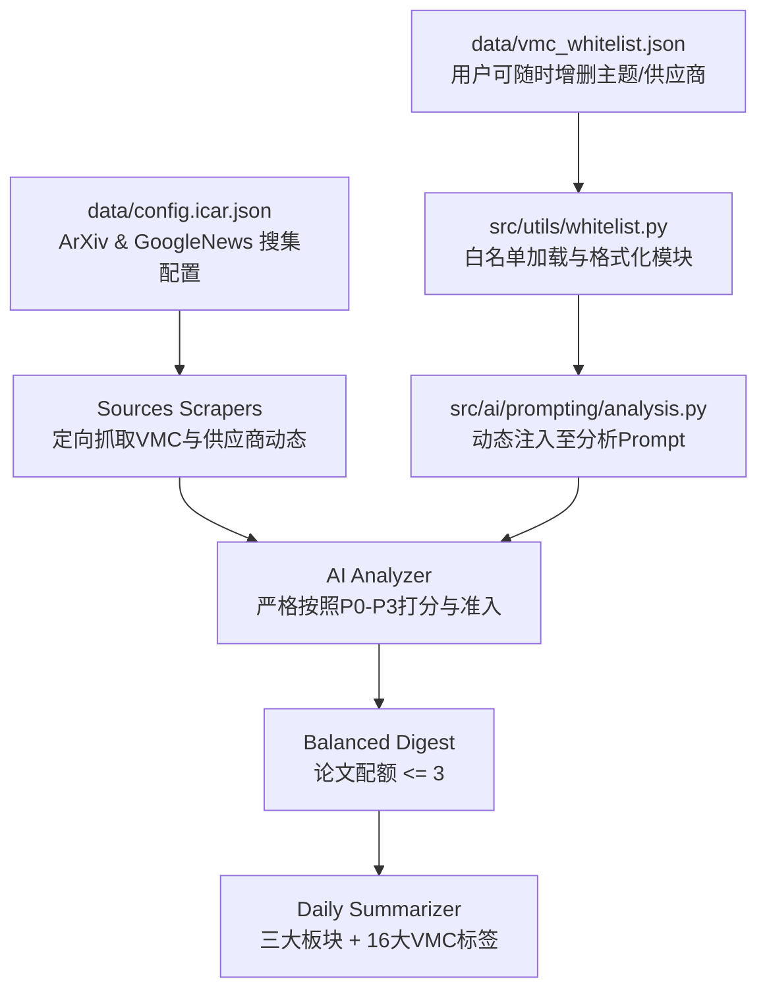

# Horizon VMC/CMC 技术雷达系统升级实施方案

根据用户的反馈与确认，方案细节已最终确定：
1. **评分机制**：采用**方案 A**（纯 LLM Prompt 强化驱动）。
2. **板块形式**：**保留现有的 3 大板块**（资讯、前沿论文、核心专利），标签统一收敛至 16 个推荐分类。
3. **论文配额**：**保留最多入选 3 篇论文**。
4. **检索源增强**：ArXiv 增加 VMC 核心词；Google News 增加 P0 核心供应商组合词（博世底盘、采埃孚底盘、大陆制动、伯特利线控、同驭科技、拿森科技等）。
5. **用户可自定义文件**：提供独立的配置文件 **`data/vmc_whitelist.json`**，供用户自由新增/修改关注的厂商、产品或关键词主题，并由底层动态读取注入至评分 Prompt 中。

---

## 架构设计

---

## 拟修改与新增文件清单

### 1. 配置与白名单模块
#### [NEW] [data/vmc_whitelist.json](file:///home/fzy/Documents/03_competition/Horizon_iCarInfo/data/vmc_whitelist.json)
记录完整的 P0/P1/P2/P3 主题与供应商、降噪惩罚词、16 个推荐分类。用户后续可自由在该文件中添加感兴趣的新厂商、新产品或关键词。

#### [NEW] [docs/vmc_whitelist_guide.md](file:///home/fzy/Documents/03_competition/Horizon_iCarInfo/docs/vmc_whitelist_guide.md)
用户操作手册，详细说明如何在该 JSON 文件中新增厂商、产品与技术主题。

#### [NEW] [src/utils/whitelist.py](file:///home/fzy/Documents/03_competition/Horizon_iCarInfo/src/utils/whitelist.py)
用于读取 `data/vmc_whitelist.json`，并将其智能转化为 Markdown 格式的 Prompt 规则注入块。

### 2. 资料搜集配置层
#### [MODIFY] [data/config.icar.json](file:///home/fzy/Documents/03_competition/Horizon_iCarInfo/data/config.icar.json)
- ArXiv 数据源关键词增加：`"vehicle motion control"`, `"control allocation"`, `"sideslip angle estimation"`, `"torque vectoring"` 等。
- Google News 数据源检索增加：`"线控底盘 OR 线控转向 OR 线控制动 OR 智能底盘 OR 整车运动控制 OR 底盘域控 OR 伯特利 线控 OR 同驭科技 OR 拿森科技 OR 博世底盘 OR 采埃孚底盘 OR 大陆制动"`。
- 维持 `digest.category_groups` 中 `arxiv-paper` 限制为 3 篇。

#### [MODIFY] [data/config.json](file:///home/fzy/Documents/03_competition/Horizon_iCarInfo/data/config.json)
同步更新 `data/config.json`，保持与 `config.icar.json` 一致。

### 3. AI 分析与评分提示词层
#### [MODIFY] [src/ai/prompting/analysis.py](file:///home/fzy/Documents/03_competition/Horizon_iCarInfo/src/ai/prompting/analysis.py)
在构建 analysis 系统提示词时，引入从 `data/vmc_whitelist.json` 动态加载的最新白名单内容。

#### [MODIFY] [profiles/icar-info/analysis.md](file:///home/fzy/Documents/03_competition/Horizon_iCarInfo/profiles/icar-info/analysis.md)
更新资讯分析 Prompt：详细落实 P0-P3 打分细则（+5/+3/+1/+4/+2/+1）、6 组准入布尔逻辑、降噪惩罚规则，以及要求输出 16 个标准分类 tags。

#### [MODIFY] [profiles/icar-info/match.md](file:///home/fzy/Documents/03_competition/Horizon_iCarInfo/profiles/icar-info/match.md)
更新分类匹配规则，重点聚焦 VMC/CMC 底盘与整车运动控制。

#### [MODIFY] [profiles/icar-papers/analysis.md](file:///home/fzy/Documents/03_competition/Horizon_iCarInfo/profiles/icar-papers/analysis.md)
更新论文分析 Prompt：评估 VMC 控制理论、状态估计、动力学建模深度与实车/仿真验证水平，输出 16 个标准分类 tags。

#### [MODIFY] [profiles/icar-papers/match.md](file:///home/fzy/Documents/03_competition/Horizon_iCarInfo/profiles/icar-papers/match.md)
更新学术论文匹配标准，确保聚焦车辆动力学与底盘控制理论。

---

## 验证方案

1. **白名单加载与格式化单元验证**：
   运行测试脚本，验证 `src/utils/whitelist.py` 能够正确加载 `data/vmc_whitelist.json` 并生成符合规范的提示词内容。
2. **配置文件 Pydantic 模型验证**：
   验证 `data/config.icar.json` 与 `data/config.json` 通过 Horizon `Config` 模型验证。
3. **系统提示词端到端生成验证**：
   运行测试，验证 `analysis_system_prompt` 正确包含了动态加载的白名单以及用户定义的词库。
4. **模拟打分逻辑验证**：
   通过典型样例（正例、边界例、负例降噪）验证打分与过滤逻辑。
