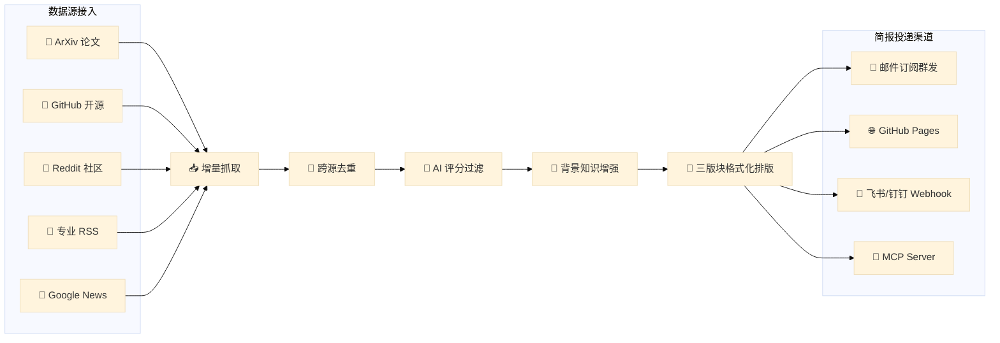

<div align="center">
<h1>🌅 Horizon iCarInfo — 智能汽车与底盘资讯每日速递</h1>

<p><strong>专注智能汽车、线控底盘与自动驾驶前沿技术的情报雷达系统</strong></p>

[](LICENSE)
[](https://github.com/astral-sh/uv)
[](https://www.python.org/)
[]()


📡 全自动追踪全网学术论文、工程开源项目、线控底盘技术发布与行业专利，AI 自动评分、背景知识扩充与多版块每日简报生成系统。

</div>

---

## 📌 项目简介

**Horizon iCarInfo (智能汽车与底盘前瞻资讯系统)** 是一套基于 AI 驱动的信息聚合与日报生成系统。它为汽车工程师、底盘控制研究员、自动驾驶算法专家以及行业分析师量身打造，旨在过滤互联网上的营销噪音，每日精准推送最具技术价值与工程深度的资讯简报。

系统自动从 **ArXiv、GitHub、Reddit、专业 RSS、Google News** 等全网多源抓取最新内容，利用大语言模型（如 DeepSeek / Claude / GPT 等）进行技术评分、重复内容去重、背景知识检索增强（RAG），并按三大核心版块自动格式化排版，最终通过**电子邮件订阅、GitHub Pages 网页、飞书/钉钉 Webhook** 等渠道自动投递。

---

## 📐 三大核心版块布局

每日生成的速递简报严格按照以下三大专业版块白名单进行编排：

```
├─ 一、智能汽车与底盘前瞻资讯 (icar-info)
│   ├── 线控底盘：线控转向 (SBW)、线控制动 (EHB/EMB)、主动/空气悬架、底盘域控制器 (VMC/CDC)
│   ├── 智驾硬件与平台：自动驾驶芯片 (如 NPU/GPU)、传感器融合、域控拓扑
│   ├── 主机厂与 Tier-1 动态：特斯拉、华为、比亚迪、蔚来、博世、大陆、采埃孚等最新工程发布
│   └── 开源与标准：Autoware, Openpilot, Carla 开源更新，SAE/ISO 26262 功能安全标准
│
├─ 二、前沿论文 (icar-papers)
│   ├── 学术预印本 (ArXiv)：cs.RO, cs.CV, eess.SY, cs.SY 等领域最新论文
│   ├── 顶级期刊与会议：IEEE T-IV, IEEE T-MECH, ICRA, IROS, CVPR 等
│   └── 算法突破：端到端智驾模型 (E2E AD)、世界动作模型 (World Models)、Occupancy 栅格、轨迹规划
│
└─ 三、前瞻专利 (icar-patents)
    └── 国内外最新公开与授权专利：线控系统冗余控制、故障容错架构、智驾安全降级策略等
```

---

## 💡 核心功能特性

- 📡 **多源情报协同检索**：集成 ArXiv 学术库、GitHub Release、Reddit 工程社区（`r/SelfDrivingCars`, `r/AutomotiveEngineering`）、专业科技 RSS（Green Car Congress, SAE）及 Google News。
- 🤖 **AI 智能评分与去重**：结合定制化的评估 Prompt，根据技术创新度、工程可行性与行业影响进行多维评分（0-10 分），自动过滤无技术实质的营销公关文，并合并多平台重复报道。
- 🔎 **背景知识深度扩充**：为选中的每条重要资讯补充「技术背景」、「技术突破」、「行业影响」与「社区讨论」等深度上下文。
- ✉️ **自动化邮件订阅服务**：内置完整的 SMTP/IMAP 邮件服务，支持用户通过发送关键字（如 `SUBSCRIBE` / `UNSUBSCRIBE`）自动加入或退出订阅列表（[data/subscribers.json](file:///home/fzy/Documents/03_competition/Horizon_iCarInfo/data/subscribers.json)），并定时群发 HTML/Markdown 双语日报。
- 🛡️ **严格版块白名单**：内置过滤器保证生成的报告仅包含汽车底盘与智驾相关的三大目标版块，自动剔除无关泛科技新闻与博客。
- 🔔 **多渠道发布支持**：支持生成 GitHub Pages 静态网站、推送飞书/钉钉/Discord 机器人，并提供 MCP Server (Model Context Protocol) 接口供 AI 助手调用。

---

## ⚙️ 系统工作流程



---

## 🚀 快速上手

### 1. 环境准备与依赖安装

确保已安装 [uv](https://github.com/astral-sh/uv)（推荐）或 Python 3.11+：

```bash
# 克隆仓库
git clone https://github.com/Horizon_iCarInfo.git
cd Horizon_iCarInfo

# 使用 uv 一键安装依赖
uv sync
```

### 2. 环境变量配置

创建 `.env` 文件并填入 API Key 和邮箱授权码：

```bash
cp .env.example .env
```

编辑 `.env`：

```env
# DeepSeek 大模型 API Key（或 OPENAI_API_KEY / ANTHROPIC_API_KEY）
DEEPSEEK_API_KEY=your_deepseek_api_key_here

# 发件邮箱密码或 SMTP 授权码（QQ 邮箱需在网页端生成 16 位授权码）
EMAIL_PASSWORD=your_16_digit_smtp_authorization_code
```

### 3. 主配置文件说明

项目主配置文件位于 [data/config.icar.json](file:///home/fzy/Documents/03_competition/Horizon_iCarInfo/data/config.icar.json)，包含了数据源、AI 模型参数、三大版块顺序与邮箱配置：

```json
{
  "ai": {
    "provider": "deepseek",
    "model": "deepseek-chat",
    "api_key_env": "DEEPSEEK_API_KEY",
    "languages": ["zh"]
  },
  "email": {
    "enabled": true,
    "smtp_server": "smtp.qq.com",
    "smtp_port": 465,
    "email_address": "438484102@qq.com",
    "password_env": "EMAIL_PASSWORD",
    "sender_name": "智能汽车每日速递"
  },
  "digest": {
    "profile_order": [
      "icar-info",
      "icar-papers",
      "icar-patents"
    ]
  }
}
```

可以将专用的配置文件设为默认配置文件：

```bash
cp data/config.icar.json data/config.json
```

---

## 💻 运行与测试指令

### 1. 执行全流程每日速递生成

抓取过去 24 小时的最新资讯并生成速递简报：

```bash
uv run horizon -c data/config.icar.json --hours 24
```

生成后的 Markdown 报告将保存在 `data/summaries/horizon-YYYY-MM-DD-zh.md`。

### 2. 单独测试邮件发送功能（无需 AI 抓取）

如果您需要验证 SMTP 邮件发送功能是否正常，可以使用以下单行 Python 指令：

```bash
uv run python -c "
from dotenv import load_dotenv
from src.storage.manager import StorageManager
from src.services.email import EmailManager

load_dotenv()
storage = StorageManager(config_path='data/config.icar.json')
config = storage.load_config()
subscribers = storage.load_subscribers()

email_mgr = EmailManager(config.email)
email_mgr.send_daily_summary(
    '# 智能汽车每日速递 - 邮件测试\n\n这是一封测试邮件，用于验证邮箱投递功能。',
    '【测试】智能汽车每日速递邮件通道验证',
    subscribers
)
print('测试邮件发送完成！')
"
```

---

## 📁 项目目录结构

```
.
├── data/
│   ├── config.icar.json     # 智能汽车与底盘速递主配置文件
│   ├── subscribers.json     # 邮件订阅者列表
│   └── summaries/           # 每日生成的 Markdown 简报保存目录
├── profiles/
│   ├── icar-info/           # 「智能汽车与底盘前瞻资讯」Profile 提示词与配置
│   ├── icar-papers/         # 「前沿论文」Profile 提示词与配置
│   └── icar-patents/        # 「前瞻专利」Profile 提示词与配置
├── src/
│   ├── ai/                  # AI 客户端、分析器、总结器与 Prompt 管理
│   ├── scrapers/            # 各数据源抓取器 (ArXiv, GitHub, RSS, Reddit, Google News)
│   ├── services/            # 邮件服务 (SMTP/IMAP) 与 Webhook 机器人通知
│   ├── storage/             # 配置加载与存储管理器
│   ├── main.py              # CLI 入口
│   └── orchestrator.py      # 工作流主调度器
└── scripts/
    └── daily-run.sh         # 每日定时自动化运行与 Pages 部署脚本
```

---

## 📄 开源许可证

本项目采用 [MIT License](LICENSE) 许可证。
